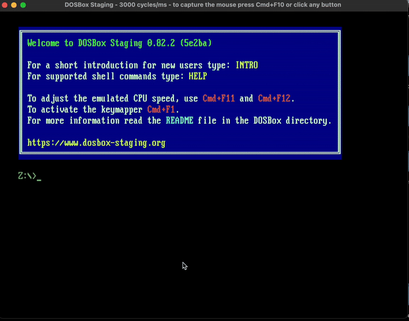

### ASM - x86 Assembly
---
8086 microprocessor
# Mac (M1) Setup
- https://www.dosbox-staging.org/ 
```
mkdir ~/dos/asm
```
```
mount c ~/dos/asm
c:
```
- Get masm.exe and link.exe (Microsoft Macro Assembler)
```
masm hello.asm
link hello.obj
hello.exe
```



# Vs-Code
- Extension: ASM Code Lens